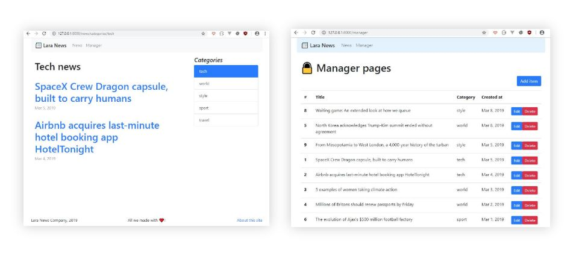

# 📰 Lara News Project



### [Требования к проекту и этапы создания](story.md)

### Как запустить проект?
1. Склонируйте или загрузите этот репозиторий
2. В папке проекта выполнить команду `composer install`
3. Создайте базу данных MySQL
4. Переименуйте `.env.example` в  `.env` и укажите параметры подключения к базе данных:
```
DB_CONNECTION=mysql
DB_HOST=127.0.0.1
DB_PORT=3306
DB_DATABASE=homestead
DB_USERNAME=homestead
DB_PASSWORD=secret
```
5. Выполните команду `php artisan migrate`
6. Заполните в базе данных таблицы `categories` и `news` или загрузите их из файла [`laranews.sql`](laranews.sql)
7. Выполните команду `php artisan key:generate`
8. Выполните команду `php artisan serve` и перейдите по адресу [http://localhost:8000](http://localhost:8000)
